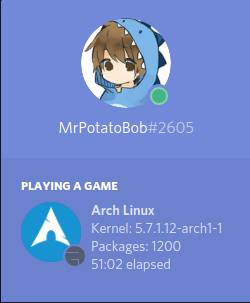

# FetchCord

Fetchcord grabs information about your distribution and displays it as Discord Rich Presence.

## Examples
   

## What works

- [x] Distribution detection

- [x] Distribution Version

- [x] Package detection

- [x] Kernel Detection

- [x] Uptime

- [x] Detecting Window Manager/Desktop Environment

- [x] Detecting GPU/CPU and display it in a cycle (thanks to Hyper-KVM)

## To-Do
- [ ] Add more distributions (If your distro is not supported open an issue)

- [ ] Detect Window Manager/Desktop Environment version

- [ ] Add Flatpak/Snap support

- [ ] Add support for desktop icon use

- [ ] More CPUs, ex. Pentium, Older AMD CPUs

- [ ] More GPUs?

## Running on (GNU/)Linux

To install the script, run `sudo ./install.sh`.

To run the script simply run `fetchcord`, python 3.8 should have the `distro` module but if you get an error install it via pip, `pip3 install distro`

python3.8 needs the `distro` module. If you get an error, install it via pip: `pip3 install distro`

## Running on MacOS
To install the script, run `sudo ./macinstall.sh`.

Run `python3 -u -m macos-rpc.py`.

## Other Examples

  

  

  

