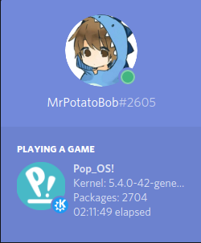
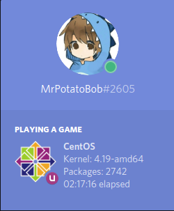

<h1 align="center">FetchCord</h1>

    
  
   
    

# Table of content
- [**Features**](#features)
- [**To-Do**](#to-do)
+ **Installing**
    - [Install on (gnu/)linux](#installing-on-gnulinux)
    - [Install on MacOS](#installing-on-macos)
 + **Running**
    - [Running on (gnu/)linux](#run)
       - [Arguments](#arguments)
    - [Running on MacOS](#run1)

- [**Examples**](#examples)

### Features

- [x] Distribution detection
 
- [x] Distribution Version

- [x] Package detection

- [x] Kernel Detection

- [x] Uptime

- [x] Detecting Window Manager/Desktop Environment

- [x] Detecting GPU/CPU and display it in a cycle (thanks to Hyper-KVM)
- [x] Flatpak support

### To-Do

- [ ] Add more distributions (If your distro is not supported open an issue)

- [ ] Detect Window Manager/Desktop Environment version

- [ ] Add Snap support

- [ ] Add support for desktop icon use

- [ ] More CPUs, ex. Pentium, Older AMD CPUs

- [ ] More GPUs?

- [ ] Add Windows support. [WIP]

## Installing on (GNU/)Linux

`pip3 install fetchcord`

NOTE: you need neofetch to be also installed for this to work.

If you want to remove FetchCord you can run `pip3 uninstall fetchcord`

You can copy the discord script to somewhere in PATH to have fetchcord run upon opening discord, making sure the discord script is executable. `sudo chmod +x /path/to/discord/script`

### Run

Once installed, simply run `fetchcord`.

If that does not work,add /home/$USER/.local/bin/ to your path, or just run `python3 -m fetchcord`.

#### Arguments
--distro, shows only distro and kernel version and package count.

--hardware, shows only CPU and GPU info.

--shell, shows only terminal and shell info.

--time, -t, set custom duration for cycles in seconds.

--terminal, set custom terminal (useful if using a script or dmenu).

--termfont, set custom terminal font (useful if neofetch can't get it).

-h or --help, shows this information above.

## Installing on MacOS

To install FetchCord, run `pip3 install FetchCord`

NOTE: you need neofetch to be also installed for this to work.

### Run 

simply run `fetchcord`

## Examples

  

  

  

  

